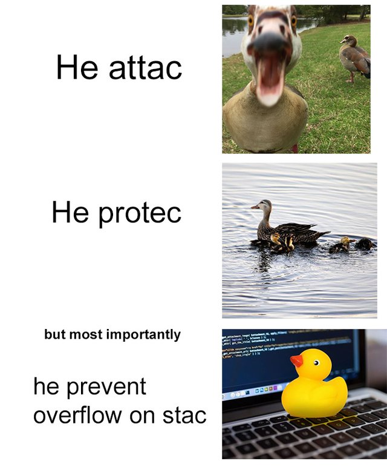

# C - Debugging

## Concepts
For this project, we expect you to look at this concept:

- [The Framework](https://github.com/jrbsandoval/low_level_programming)

## Resources
Read or watch:

- [Debugging](https://intranet.hbtn.io/rltoken/iADtJa-KkjYI56m-cQyWIw)
- [Rubber Duck Debugging](https://intranet.hbtn.io/rltoken/sS_CVV32moC3tyEImNCvig)

Debugging is the process of finding and fixing errors in software that prevents it from running correctly. As you become a more advanced programmer and an industry engineer, you will learn how to use debugging tools such as gdb or built-in tools that IDEs have. However, it’s important to understand the concepts and processes of debugging manually.

## Learning Objectives

### General

- What is debugging
- What are some methods of debugging manually
- How to read the error messages

