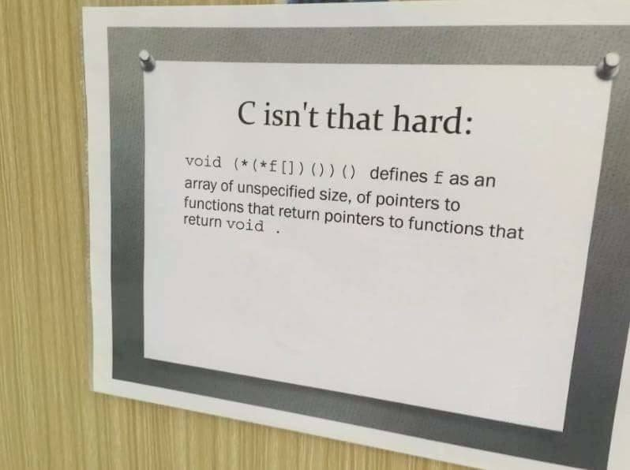

# 0x06. C - More pointers, arrays and strings

## Concepts

For this project, we expect you to look at these concepts:

- [Pointers and arrays](https://intranet.hbtn.io/concepts/60)
- [Data Structures](https://intranet.hbtn.io/concepts/120)

## Resources
Read or Watch:

- [C - Arrays](https://intranet.hbtn.io/rltoken/JDzn5TfvFN41WKKvjOfvTg)
- [C - Pointers](https://intranet.hbtn.io/rltoken/9CA1cUi3AxHOszdncsKC7g)
- [C - Strings](https://intranet.hbtn.io/rltoken/VBdJIrssmpg5YLOfoGTVnA)
- [Memory Layout](https://www.youtube.com/watch?v=_8-ht2AKyH4)

## Learning Objectives:
General

- What are pointers and how to use them
- What are arrays and how to use them
- What are the differences between pointers and arrays
- How to use strings and how to manipulate them
- Scope of variables
